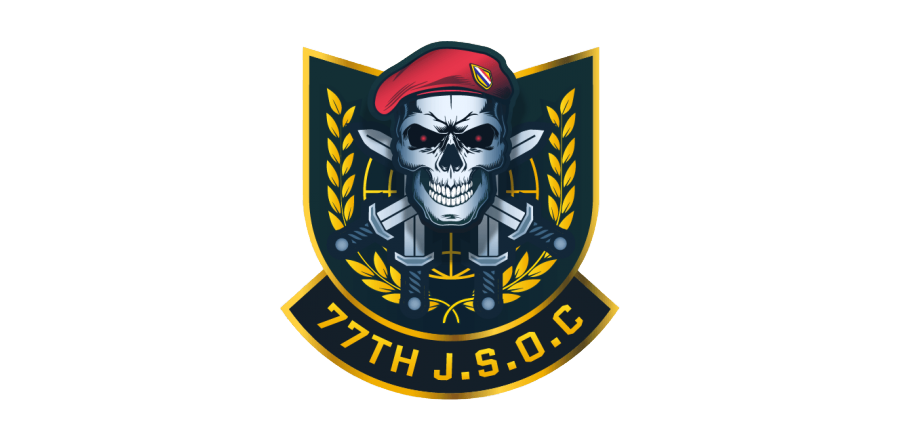

<p align="center">
  
</p>

# STM Core

Self-hosted Arma 3 server telemetry, event history and monitoring dashboard for **Linux and Windows**.

**Latest stable release: v0.8.15**

v0.8.15 provides clearer browser session logging, SQLite-backed active-personnel history, stable restart navigation, safe Watchdog startup hydration, and a refreshed 14-chapter offline **STM Field Manual**.

[](https://github.com/retekniker/STM-Core/releases)

STM Core monitors Arma 3 servers directly through GameDig/A2S without depending on BattleMetrics. It runs locally in the background, stores historical data in SQLite and provides a browser-based community dashboard.

## Features

- Monitors multiple Arma 3 servers
- Tracks server status, map, latency and player count
- Displays current player lists
- Recognizes 77th JSOC members by official rank prefixes and clan identifiers
- Highlights important personnel and shows an `ADMIN ON SERVER` presence alert
- Uses a red-white alarm animation for confirmed priority personnel
- Shows readable restart flags with enlarged hover targets on telemetry charts
- Opens Activity Feed in a responsive inspector with the same live entries and Restart Log
- Synchronizes confirmed Activity Feed clearing across connected dashboards while preserving telemetry, restart markers, uptime and chart history
- Improves the readability of blinking Asset Saturation status labels
- Detects player joins and disconnects
- Detects server restarts through Steam ID rotation
- Detects confirmed offline-to-online restart cycles
- Stores restart events, server events and snapshots in SQLite
- Restores restart clocks after STM Core is restarted
- Hydrates each Watchdog from exact confirmed SQLite restart history when the latest restart is less than eight hours old, without creating a restart event
- Continues monitoring after the browser is closed
- Provides live dashboard updates through REST API and WebSocket
- Windows system tray controller
- Optional automatic startup with Windows
- Linux background service through systemd
- Local configuration and data storage

## Windows installation

Download the latest Windows installer:

**https://github.com/retekniker/STM-Core/releases/latest**

Run the downloaded installer:

v0.8.15 release asset:

`STM-Core-Setup-0.8.15-x64.exe`

Installing a newer version over an existing installation preserves the database and configuration.

The Windows system tray icon provides:

- Open Dashboard
- Start STM Core
- Stop STM Core
- Restart STM Core
- Start with Windows
- Current running status
- Exit STM Core

## Linux installation

Self-contained v0.8.15 release assets:

- `STM-Core-0.8.15-linux-x64.tar.gz`
- `STM-Core-0.8.15-linux-x64.tar.gz.sha256`

Install or update STM Core with:

```bash
curl -fsSL https://raw.githubusercontent.com/retekniker/STM-Core/main/install.sh | bash
```

After installation, open STM Core from the application menu or run:

```bash
stm-core open
```

Available commands:

```bash
stm-core open
stm-core start
stm-core stop
stm-core restart
stm-core status
stm-core logs
```

The Linux version runs as a systemd user service and continues monitoring after the browser is closed.

Running the installer again updates STM Core while preserving the existing configuration and database.

## Dashboard

Open the community dashboard at:

```text
http://127.0.0.1:3000/community/
```

The dashboard displays live server status, connected players, restart clocks, activity events and voice notifications.

Browser-based voice notifications must be enabled from the dashboard after opening the page.

## Manual installation

Requirements:

- Node.js 18 or newer
- npm
- Git

Clone and install:

```bash
git clone https://github.com/retekniker/STM-Core.git
cd STM-Core
npm ci
npm start
```

Then open:

```text
http://127.0.0.1:3000/community/
```

## Server configuration

Monitored servers are configured in:

```text
config/servers.json
```

Each server entry contains its identifier, display name, address and query port.

## Data storage

STM Core stores runtime data locally in SQLite.

Default project database:

```text
database/stm.db
```

Windows application data:

```text
%LOCALAPPDATA%\STM-Core
```

Linux installation directory:

```text
~/.local/share/stm-core
```

The database contains server snapshots, detected events and restart history.

Runtime databases, environment files, logs and installed dependencies are excluded from Git.

## Background monitoring

STM Core operates independently from the browser.

Closing the dashboard does not stop monitoring. Server polling, restart detection and event storage continue in the background as long as STM Core is running and the computer is not turned off or suspended.

## Updating

### Windows

Download the newest installer from:

**https://github.com/retekniker/STM-Core/releases/latest**

Install it over the existing version.

### Linux

Run:

```bash
curl -fsSL https://raw.githubusercontent.com/retekniker/STM-Core/main/install.sh | bash
```

Existing data and configuration are preserved during updates.

## Project status

STM Core is the current actively maintained successor to the original browser-only STM dashboard.

The legacy version was archived because changes introduced by BattleMetrics made its previous monitoring method unreliable.

## License

No open-source license has been selected.

All rights reserved.
